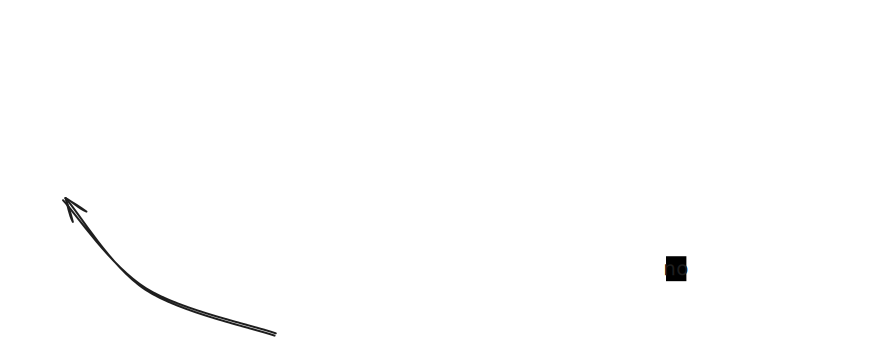

# Brake calibration 
the following procedure will aid in calibrating the braking. 
The should be done in a straight line. 

## Controls
| Control       | Action            |
|---------------|-------------------|
| **Normal**    |                   |
| `L2`          | brake             |
| `R2`          | gas               |
| `L1`          | gear up           |
| `R1`          | gear down         |
| `left stick`  | steering          |
| **Procedure** |                   |
| `Arrow up`    | select lockup     |
| `Arrow down`  | select no lockup  |
| `Arrow right` | confirm selection |
| `X`           | start braking     |
| `B`           | start procedure   |

## Procedure
to calibrate the breaking force we will need to repeatedly brake and adjust the braking force.
if the wheels lock up, reduce the braking force. if the wheels do not lock up, increase the braking force.

the reduction will be done by using a binary search algorithm. the initial braking force will be 50%.
the initial range of braking force will be 0-100% with steps configurable in the config.py file.

### Steps
1. drive to the starting point
2. stop the car
3. start the procedure by pressing `B`
4. accelerate to target speed (configurable in config.py)
5. press `X` to start braking
6. once stopped press `Arrow up` if the wheels locked up, press `Arrow down` if the wheels did not lock up
7. press `Arrow left` to confirm the selection
8. repeat from step 4 until the braking force is calibrated. around 5 iterations are expected
9. once calibrated, press `B` to end the procedure

## End of procedure
once the procedure is ended, the braking force will be set to the calibrated value.
the calibrated value will be saved in the results.txt file.

## Configuration
the following parameters can be configured in the config.py file
- `target_speed` the speed at which the car will be braked
- `braking_force_step` the step of the braking force
- `braking_force_min` the minimum braking force
- `braking_force_max` the maximum braking force

